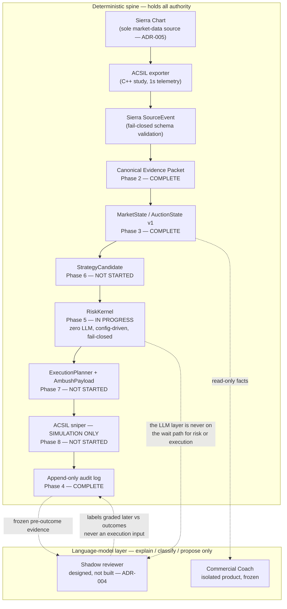

# Autonomous Trading Systems Lab — Engineering Case Study (public edition)

> **Status:** Living / in progress — build is at **Phase 5 of 10** as of **2026-10-04**.
> **Scope of this document:** process, architecture, and engineering discipline. It is a curated, sanitized export.
> **Not included:** trading edge, strategy parameters, credentials, account data, machine paths.
> **Claims rule:** every factual claim is traceable to private engineering evidence, **or** is explicitly labelled *designed / in progress / not yet proven*.
> **Rendered version:** [GitHub Pages](https://heyitschien.github.io/autonomous-lab-case-study/) — same content, self-contained, and designed for visual reading.
> **Internal evidence:** maintained in the private source repository and available for screen-share during an interview.

---

## TL;DR (30 seconds)

I direct an AI-assisted engineering process — I own the architecture, the review standards, the evidence bar, and the human approval gates — and I use multiple AI agents as builders and independent reviewers to develop a **safety-critical trading research system** for Micro E-mini S&P 500 (MES) futures.

The system is deliberately built so that **deterministic code holds all authority over risk and execution**, while language models are only allowed to explain, classify, and propose. It is **not** a profitable bot, it does **not** place live trades, and no trading edge has been proven. The interesting artifact is the **laboratory around the strategy**: source provenance, a deterministic market-state layer, an audit trail held to safety-critical standards, an evidence-judging discipline, and a multi-agent operating model with a human promotion gate.

---

## What this is / what this is not

| This case study demonstrates | This case study does **not** claim |
| --- | --- |
| How a shipped decision-support product evolved into a safety-first autonomous research system | That the system trades profitably |
| A layered architecture that separates **evidence → intelligence → authority → evaluation → promotion** | That any strategy has positive expectancy |
| A repeatable multi-agent workflow with independent review and exact-commit evidence | That live brokerage execution exists |
| Real failures converted into regression tests and stronger validators | That AI is making trade decisions |
| Transferable lessons about directing AI-assisted engineering | A finished project — it is mid-build |

**This is not financial advice and not an offer of any product.**

---

## 1. The problem

Day trading MES requires fast orientation under time pressure: *Is the market live? What did the regular session do versus the overnight session? Is the data I'm looking at stale? What structure is actually forming?* Getting that picture wrong is expensive, and getting it from a chart alone is slow.

The first product answered that for a **human**. The current work asks a harder question: can a **deterministic system** be trusted to identify a bounded setup, evaluate risk, and (eventually, in simulation only) act — with language models contributing intelligence but never authority?

---

## 2. Evolution in one picture

```text
2026-05   MES Co-Pilot (a.k.a. "Coach") — SHIPPED, then frozen
          Pine chart sensors -> webhook -> merged market state -> Chrome extension -> on-demand LLM coach
          Decision support only. Proved the conversation layer and the "deterministic facts first" principle.
                      |
                      |  Realisation: the ceiling was not prompt quality. It was data quality,
                      |  freshness, provenance, and deterministic state.
                      v
2026-07   Split: keep the commercial Coach isolated; start a separate PERSONAL autonomous lab.
          ADR-004: language models never enter the execution chain.
          ADR-005: Sierra Chart becomes the single autonomous market-data source.
                      |
                      v
2026-08   Phase 2  Sierra events -> canonical Evidence Packet ......... COMPLETE  (PR #149)
          Phase 3  deterministic MarketState / AuctionState v1 ........ COMPLETE  (PR #151 + #168)
          Phase 4  PaperIntent + audit log + paper broker ............ COMPLETE  (PR #170 + #175)
          Phase 5  deterministic RiskKernel ........................... IN PROGRESS (issue #79, PR #176 draft)
          Phase 6-10  strategy, planner, sim sniper, replay, live-readiness ... NOT STARTED
```

The Coach is **maintain-only** and was frozen on 2026-05-23 (`main` at `67c12de`, private evidence) with its own reflection package. It is the proof that the operator ships finished work; the autonomous lab is the proof of how the operator directs rigorous AI-assisted engineering.

---

## 3. Architecture

The core idea: **a deterministic spine owns every irreversible decision. Language models sit beside the spine, never inside it.**



**Load-bearing rules (all enforced in canonical specs today):**

- The LLM is **not** in the execution path. Order is always deterministic rules → risk → planner → sniper.
- `RiskKernel` performs **zero language-model interpretation**; it is config-driven and **fail-closed** (unknown state ⇒ reject).
- **Paper / simulation before live.** Live mode is gated behind a signed human review that does not exist yet (Phase 10).
- The commercial Coach and the personal lab **share deterministic facts but never share authority**, and the Coach deploy must not import lab code.

---

## 4. How it is built — the operating model

The differentiator of this project is not the trading idea. It is the **discipline of the process** that produces it.

### Roles

| Role | Who | Authority |
| --- | --- | --- |
| **Operator** | Human (project owner) | Sets intent and priorities; approves manual validation, merges, and any irreversible step. Only role that can promote work to "done". |
| **Builder agent** | AI (in-IDE) | Implements code, docs, and tests; opens PRs; reports with exact commit SHAs. May **not** self-approve an important merge. |
| **Independent review agent** | AI (separate context) | Audits the PR against the issue's acceptance criteria using live repository state — CI, diffs, review threads. Does not trust the builder's summary. |
| **Documentation / case-study agent** | AI | Maintains institutional memory and this case study. No runtime authority. |

### Rules that make the review real

- **Exact-HEAD truth.** Every handoff carries the full 40-character commit SHA. If `HEAD` moves, the previous review verdict expires and the review is redone.
- **Green is not done.** Status is tracked in six distinct states — `documented`, `implemented`, `automated-tests-green`, `CI-green`, `operator-verified`, `complete` — and they are never collapsed into a generic "done".
- **A review comment is not proof of a defect.** The reviewer must confirm the concern against the code as it exists at that commit.
- **Commit-before-reveal evaluation.** The evaluation architecture (`PR #158` *(private evidence)*) requires that a hypothesis, its dataset, and its scoring are committed *before* out-of-sample data is revealed. Holdout exposure is logged in an append-only ledger. No look-ahead, no exam re-use.
- **The judge is part of the system.** Evidence-judging scripts get their own adversarial tests, because a passing check can still certify the wrong claim.

The full protocol lives in GitHub issue `#150` *(private evidence)*, which is the persistent coordination channel between operator, builder, and reviewer.

---

## 5. Four failures that made the system better

A clean story that hides these would be less useful. Each of these changed a test, a gate, or an architecture rule.

### 5.1 An external API meant something other than what the code assumed

**Incident `SIR-DEF-001`.** The Sierra API call for "trading day date" returns a *date value* (days-since-epoch style integer), not a `YYYYMMDD` integer. The exporter treated it as `YYYYMMDD` and rejected every telemetry post as an invalid trading day — fail-closed, so nothing corrupt got through, but the operator gate was blocked.

- **Root cause class:** external-API semantic mismatch. Compilation proved the API was *available*, not that it was *understood*.
- **Fix + proof:** `PR #115` *(private evidence)* (merged 2026-07-23; fix commit `21e5692`); 72-assertion regression suite over date-value vectors; original operator replay gate re-run and passed after rebuild.
- **Rule added:** any external value involving date, time, units, lifecycle, identifiers, or status codes must be validated against installed headers, official docs, a regression fixture, and — where it matters — a live operator probe.

### 5.2 A validator passed on a weak proxy

**Incident `SIR-134-001`.** A capture step recorded three "market advancing" samples that all carried the **same bar-start timestamp** as the paused baseline — the replay clock had not actually moved. The validator correctly rejected it, which exposed that the capture policy itself was too loose.

- **Fix + proof:** `PR #142` *(private evidence)* (merged 2026-08-03; fix commit `2680236`). Playing-state writes now require a strictly-later chart time; same-bar heartbeats return `waiting_chart_time_advance` instead of consuming a capture slot. Regression tests cover the same-bar and timestamp-only cases. Operator re-validated.
- **Lesson:** "the check passed" is not the same as "the check proved the claim". This became a cross-cutting doctrine.

### 5.3 The evidence judge itself needed hardening

During Phase 3 operator validation, a sequence of independent reviews (logged across the doc changelog, 2026-08-08 → 2026-08-24, feeding `PR #151` *(private evidence)*) repeatedly found that a passing operator script could still certify the wrong thing: a "paused" proof that a fast replay could satisfy while still moving; a "first accepted packet" proxy that was weaker than the next packet; semantic-attestation files that could pass an existence check while being empty.

- **Consequence:** an **exact-claim doctrine** — the judge must bind each assertion to the specific artifact (chart time, bar indices, SHA-256) it claims to prove; a "paused-first" machine invariant; transition-window / race analysis added to the pre-flight checklist; immutable evidence and chronology requirements.
- **Lesson:** in a safety-critical system, the test of the tester can matter as much as the test of the product.

### 5.4 "Executed" is not "passed" — caught before promotion

While building the model-agnostic review tooling (`issue #179` *(private evidence)*, PR `#182` *(private evidence)*), the independent review agent blocked the PR: the new evidence gate recorded that a validation command had *run*, but a run that **exited non-zero** could still satisfy "review context complete" and allow a `COMPLETE` status. Executed ≠ passed.

- **Outcome:** the correction was independently reviewed and merged on 2026-08-27. The incident remains here because it shows the review process catching a subtle evidence-integrity gap before promotion.

---

## 6. What is proven vs. not (as of 2026-10-04)

The current public truth has two layers: protected private `main` still contains
the fail-closed RiskKernel stub; draft PR #176 contains many accepted Phase-5
micro-slices plus active corrections. Its authoritative lab CI was green at the
October 4 snapshot, but the pull request remains unmerged, not merge-ready, and
subject to exact-commit independent review. **No `ALLOW` path is claimed.**

| Capability | documented | implemented | tests green | CI green | operator-verified | complete |
| --- | :--: | :--: | :--: | :--: | :--: | :--: |
| Sierra telemetry exporter (historical replay) | ✅ | ✅ | ✅ | ✅ | ✅ | ✅ |
| Sierra event → canonical Evidence Packet (Phase 2) | ✅ | ✅ | ✅ | ✅ | partial | ✅ (v1) |
| Deterministic MarketState / AuctionState v1 (Phase 3) | ✅ | ✅ | ✅ | ✅ | partial | ✅ (v1) |
| PaperIntent + append-only audit + paper broker (Phase 4) | ✅ | ✅ | ✅ | ✅ | ❌ | ✅ (first slice) |
| LLM audit-correlation fields reserved (nullable, no client) | ✅ | ✅ | ✅ | ✅ | n/a | ✅ |
| Deterministic RiskKernel (Phase 5, draft branch only) | ✅ | partial | partial | partial | partial | ❌ |
| StrategyCandidate / trend-pullback (Phase 6) | ✅ | ❌ | ❌ | ❌ | ❌ | ❌ |
| Execution planner, sim sniper, replay validation (Phase 7–9) | ✅ | ❌ | ❌ | ❌ | ❌ | ❌ |
| Shadow language-model reviewer | ✅ (spec) | ❌ | ❌ | ❌ | ❌ | ❌ |
| **Positive trading expectancy** | — | — | — | — | — | **not attempted; explicitly out of scope until Phase 9** |
| **Live brokerage execution** | — | — | — | — | — | **prohibited until a signed Phase 10 review** |

"partial" operator-verified = specific gates within the phase were run by the human operator; the whole phase does not have a single sign-off.

---

## 7. Tech stack

| Layer | Technology |
| --- | --- |
| Market-data sensor | Sierra Chart + custom **ACSIL (C++)** telemetry study |
| Contracts / validation | Node.js, Zod fail-closed schemas |
| Deterministic brain | Node.js (`market-brain` package: SourceEvent, Evidence Packet, MarketState, AuctionState) |
| Audit / paper layer | Node.js, append-only event log with semantic idempotency and durable-write recovery |
| Earlier product (Coach, frozen) | Pine Script v6, Express on Railway, Neon Postgres, Chrome MV3 + React + TypeScript |
| Evaluation | Custom eval architecture — EvalPlan, immutable dataset manifest, holdout ledger, R-multiple scoring, counterfactual separation |
| Process | GitHub (issues, PRs, CI, exact-SHA evidence), Linear (planning), a persistent multi-agent coordination thread |
| AI agents | In-IDE builder agent; separate independent-review agent; documentation agent |

---

## 8. Transferable lessons (beyond trading)

1. **Evidence quality is the ceiling on AI usefulness.** Once the deterministic inputs were clean, prompt engineering stopped being the bottleneck.
2. **Separate intelligence from authority.** A probabilistic model becomes *more* useful when it is given *less* irreversible power — it can freely propose because it cannot act.
3. **Green checks are not proof.** Track `documented / implemented / tests-green / CI-green / operator-verified / complete` separately and never collapse them.
4. **Test the tester.** Any script that certifies a claim needs adversarial tests of its own.
5. **Independent review beats self-report — including for prose.** Documentation can broaden scope just like code can; it deserves the same review.
6. **A trustworthy notebook precedes a trustworthy strategy.** The audit path was hardened to safety-critical standards *before* any strategy code was written.
7. **Directing AI-assisted engineering is a real skill.** The human job moved up: from writing every line to governing intent, architecture, evidence standards, and promotion.

---

## 9. Selected evidence

| Milestone | Evidence | Merged |
| --- | --- | --- |
| Coach shipped and frozen | reflection package, `main` `67c12de` *(private evidence)* | 2026-05-23 |
| No LLM in the execution chain | ADR-004 | 2026-07-08 |
| Sierra as sole autonomous data source | ADR-005, issue `#135` *(private evidence)* | 2026-07-22 |
| Sierra telemetry exporter + first API-semantics incident | PR `#115` *(private evidence)* | 2026-07-23 |
| Bounded capture / weak-proxy incident fix | PR `#142` *(private evidence)* | 2026-08-03 |
| Sierra events → Evidence Packet (Phase 2) | PR `#149` *(private evidence)*, issue `#76` *(private evidence)* | 2026-08-05 |
| Canonical evaluation architecture (commit-before-reveal, holdout ledger) | PR `#158` *(private evidence)* | 2026-08-10 |
| Research-institution direction (models as scientists, not traders) | PR `#160` *(private evidence)*, issues `#156` *(private evidence)*/`#159` *(private evidence)* | 2026-08-12 |
| Deterministic MarketState / AuctionState v1 (Phase 3) | PR `#151` *(private evidence)* + `#168` *(private evidence)*, issue `#77` *(private evidence)* | 2026-08-20 |
| PaperIntent + audit + paper broker (Phase 4) | PR `#170` *(private evidence)* + `#175` *(private evidence)*, issue `#78` *(private evidence)* | 2026-08-22 / 25 |
| Deterministic RiskKernel (Phase 5) | issue `#79` *(private evidence)*, PR `#176` *(private evidence)* (draft) | in progress |
| Multi-agent coordination protocol | issue `#150` *(private evidence)* | ongoing |
| Living case-study system | issue `#164` *(private evidence)*, PR `#173` *(private evidence)* | ongoing |

---

## 10. Public release boundary

This public copy is a curated process and engineering case study. Publication does **not** transfer or expose the co-owned private source repository.

Public-safety checks applied to this export:

- **Sanitised:** no credentials, tokens, secrets, machine-local paths, broker/account identifiers, or third-party personal data.
- **No edge leakage:** no strategy parameters, trigger thresholds, or order-flow logic.
- **Bounded claims:** no profitability, positive-expectancy, or live-execution claim; capability states remain explicit in §6.
- **Private evidence separated:** issue, PR, and commit references are labels only; private URLs are not published.
- **Public destination:** the rendered page and markdown live in this repository; the private repository remains the engineering source of truth.

---

## Author's note

I use "the operator" throughout to describe my role accurately: I did not hand-write every line of this system. I set the direction and architecture, defined the evidence and safety standards, ran the independent-review model, performed the manual validations, and made every promotion decision — while AI agents did much of the implementation and a separate agent audited it. The honest version of this story is more interesting than "AI built a trading bot", and it is the version an interviewer can trace back to commits.

*Private source status reconciled 2026-10-04; public export refreshed 2026-10-04. Not financial advice.*
