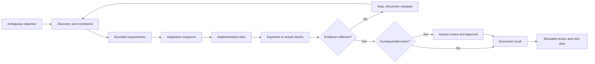

# Public-Safe Workflow Diagram

```mermaid
flowchart LR
    A[Ambiguous objective] --> B[Discovery and constraints]
    B --> C[Bounded requirements]
    C --> D[Integration sequence]
    D --> E[Implementation slice]
    E --> F[Expected vs actual checks]
    F --> G{Evidence sufficient?}
    G -- No --> H[Stop, document, escalate]
    H --> B
    G -- Yes --> I{Consequential action?}
    I -- Yes --> J[Human review and approval]
    I -- No --> K[Document result]
    J --> K
    K --> L[Reusable lesson and next slice]
```

The diagram shows the process rather than private system architecture. It
keeps the human decision boundary visible and makes missing evidence a
stopping condition.
